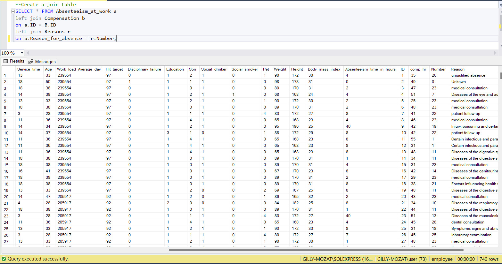

# Gutmann LLC: Employee Wellness & Absenteeism Analysis

## Introduction

This data analysis project aims at leveraging analytics to drive employee incentives and wellness at Gutmann LLC, an imaginary company committed to fostering a healthy work environment and reducing absenteeism rate.

Gutmann's HR department is seeking to leverage data analytics to drive two key initiatives:
1. **Healthy Bonus Program:** Reward employees who prioritize their health and demonstrate low absenteeism rates.
2. **Non-Smoker Wage Increase:** Provide financial incentives to non-smoking employees, potentially offsetting their higher insurance premiums.

The HR Department sent the following request to me, a Data Analyst of the company, seeking for a data-driven solution:
- Provide a list of **Healthy Individuals & Low Absenteeism** for our healthy bonus program – Total Budget of $1000 USD.
- **Calculate a Wage Increase** or annual compensation for Non-Smokers for – Insurance Budget of $983,221 for all Non-Smokers
- **Create a Dashboard** for HR to understand Absenteeism at work.

**_Disclaimer_**: _All datasets and reports do not represent any company, institution or country, but just a dummy mock data to demonstrate my skills of Data Analysis with SQL and Power BI._

## Problem Statement

Gutmann LLC recognizes the importance of employee well-being and aims to reduce absenteeism while promoting healthier lifestyle among its employees.
The HR department seeks actionable insights to implement initiatives that reward healthy behaviors and minimize absenteeism. 

**After a critical thinking, I discovered some key challenges which include:**
- Identifying healthy individuals
- Measuring low absenteeism
- Calculating annual compensation rate increase for non-smokers
- Creating an informative dashboard

## Data Sourcing

The data was stored in separate CSV files and locally saved in a folder. There were 3 separate CSV files with each having 1 table or worksheet resulting into 3 tables:
- Absenteeism_at_work
- Compensation
- Reasons

The datasets were locally exported into Microsoft SQL Server for exploratory data analysis.

## Data Transformation

Before I exported the data into Microsoft SQL server, I assessed the quality and completeness of the datasets in order to address any missing data or inconsistencies. Data cleaning was performed on each table, and all tables appeared to be clean. There were no nulls or errors in all columns.

## Exploratory Data Analysis

I used Microsoft SQL Server for exploratory data analysis. First, I created a database labelled <code>employee</code>. Then, I uploaded the separate CSV files which had the following table names; <code>Absenteeism_at_work</code>, <code>Compensation</code>, and <code>Reasons</code>.

The first query I developed was to join the 3 separate tables into one complete table. The main or fact table is <code>Absenteeism_at_work </code> table. So, I joined both the <code>Compensation</code> and <code>Reasons</code> tables to the main table with a left join condition. After the join, I checked for the number of columns and rows and discovered there were **25 columns** and **740 rows**. Below is a snapshot after the join.

## Task 1

The first analysis task is to provide the list of **healthy individuals** and **low absenteeism** that the $1000 bonus would be shared among.

First, I had to find the healthiest individuals (employees) but, the HR didn't give me any real criteria based on what is healthy so I had to design this on my own using some elements from the fact or main table, and then pass back the list to the HR for some feedback.

In the main table, <code>Absenteeism_at_work</code>, I discovered some supporting factors which helped my assumption for designing the criteria for healthiest individuals. I made my judgement from the following columns; <code>Social_drinker</code>, <code>Social_smoker</code>, <code>Body_mass_index</code>, and <code>Absenteeism_time_in_hours</code>. I presumed the healthiest individuals to be; those who do not drink nor smoke, those within a particular range of BMI, and had absence time lower than the average absenteeism time.

Below is the query I developed.

Also, I developed the query to measure low absenteeism. The assumption was defined based on those who had absence time lower than the average. I limited the output to the first 20 rows in order to keep the output clean. I also sorted in descending order to figure out the highest time within the range of measure for low absenteeism.

Below is a snapshot of the query and output.

## Task 2

I checked the annual compensation rate increase for non-smokers. First, I ran a query to count the number of non-smokers from the <code>Absenteeism_at_work</code> table. This was needed to help me in calculating the increase rate per year for each non-smoker. Below is a screenshot of the output of the count query for non-smokers.

Now, I need to calculate the increase rate that each non-smoker is going to get. According to the request from the HR, the insurance budget of $983,221 is to be distributed among the non-smokers. So, I did the following calculations below.

Finding the total amount of hours they work per year:

=> 5 days a week * 8 hours per day * 52 weeks in a year

=> 5 x 8 x 52 = 2,080 hours/year

So, 2,080 is the number of hours that the employees are working per year. I multiplied the total number of hours per year by the total number of non-smokers.

=> 2,080 x 686 = 1,426,880

In finding the increase rate per hour, I divided the budget amount of $983,221 over 1,426,880. 

=> 983,221/1,426,880 = **0.68 increase per hour**.

In finding how much each non-smoker receives for the increase rate per year, I did the following calculation:

=> 5 days a week * 8 hours per day * 52 weeks per year * 0.68 increase per hour

=> 5 x 8 x 52 x 0.68 = $1,414.4 per year.

## Data Transformation

After joining the tables in SQL server, the full table happened to contain some duplicate columns so the transformation was necessary. I optimized the data by indicating which columns to maintain and removing the ones that wouldn’t be necessary for the purpose of this analysis.

I also used <code>CASE</code> statement to change <code>Body_mass_index</code> and <code>Seasons</code> columns by categorizing them. Below is a screenshot of the full table after the transformation. The table was having 18 columns and 740 rows.

Again, I created a new dimension table labeled <code>healthy_group</code> where I categorized those who are healthy and unhealthy.

Then, I exported the transformed tables into Power BI for visualization and detailed analysis.

# Power BI

## Data Modeling

Power BI automatically modeled the datasets by connecting the dimension table <code>healthy_group</code> to the main table <code>Absenteeism_at_work</code>, using 1:1 relationship.

## Data Visualization

You can interact with the report by [clicking here](https://app.powerbi.com/view?r=eyJrIjoiOWI1MTQ4ZjAtMzZkMC00MTcxLWE1YzgtN2VkNzIxNzkyYzBkIiwidCI6ImZkMjljODFlLWI1YzUtNDAzNS1hZGIyLTBmMGJjODhiMzM2NyJ9)

## Insights and Recommendations

### Insights:
- Out of the total 740 employees, only 125 met our definition of "healthy", representing approximately 16.89% of the workforce.
- Despite being a minority, healthy employees demonstrated significantly lower absenteeism, with an average absenteeism time of 2.12 hours compared to the overall average of 6.92 hours.
- The total number of non-smokers in the company was 686.
- Based on the allocated insurance budget of $983,221, the calculated wage increase per year per non-smoker amounted to $1,414.4.
- The total absenteeism hours for the analyzed period amounted to 5124, indicating a significant impact on productivity and operational efficiency.
- Absenteeism was observed across all seasons, with Spring having the highest absenteeism, with 204 employees and Fall the lowest, with 171 employees. Further analysis should uncover reasons for the absenteeism during these seasons (e.g., weather, holidays).

### Recommendations:
- Award the healthy bonus to the 125 identified employees, recognizing their commitment to health and reducing absenteeism.
- Implement targeted wellness programs and incentives to encourage healthier behaviors among employees. This could include promoting exercise, offering healthier food options, and providing resources for stress management and mental well-being. Additionally, consider expanding the healthy bonus program to incentivize more employees to adopt healthier lifestyles.
- Implement the proposed wage increase per year to incentivize non-smoking employees and promote a healthier work environment. Additionally, consider investing in smoking cessation programs to support employees in quitting smoking and improving their overall health.
- Analyze correlations between absenteeism and other factors like absenteeism rates by month, season, and day of the week, as well as reasons for absence to pinpoint specific areas of concern.

## Conclusion

Through the analysis, it was revealed that healthy employees demonstrate significantly lower absenteeism rates, highlighting the importance of wellness initiatives in improving overall employee health and productivity. By implementing targeted programs and incentives, such as the healthy bonus program and wage increase for non-smokers, Gutmann LLC can create a healthier work culture and reduce absenteeism, ultimately leading to improved employee satisfaction and organizational success.

***

###### Thank you for taking your time to review this project. [Contact me here](mailto:mgilbertnana@gmail.com)

